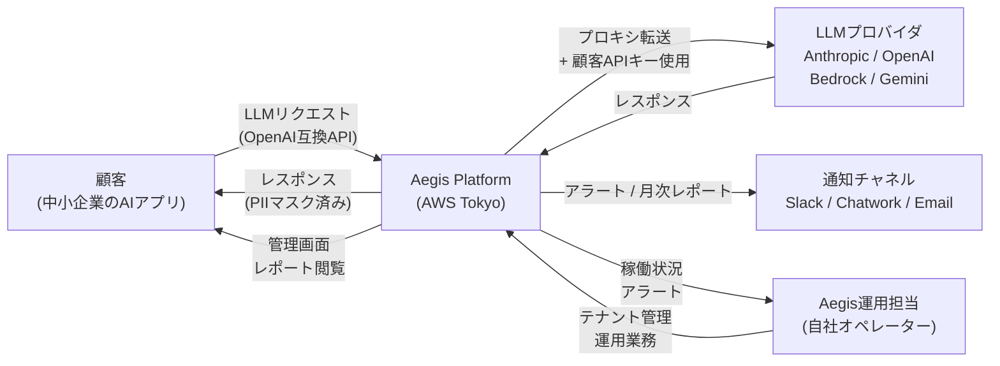
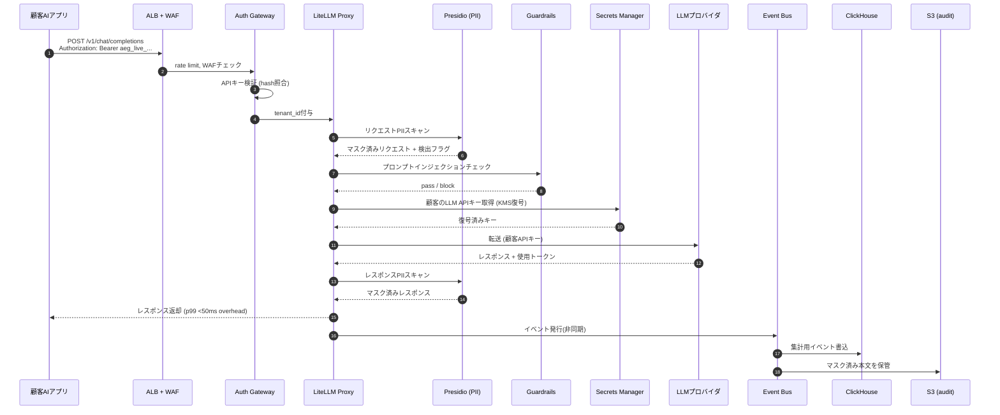
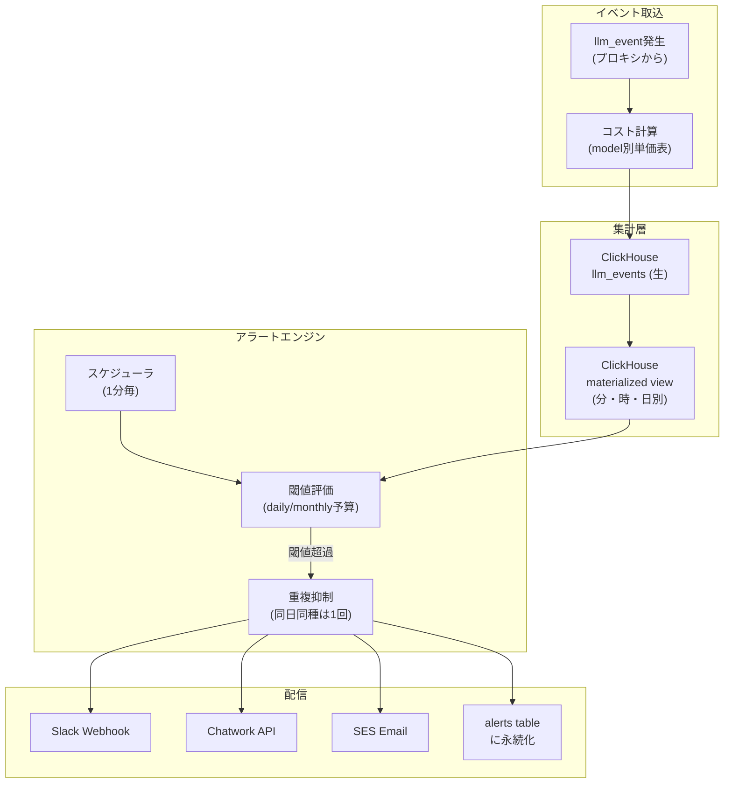
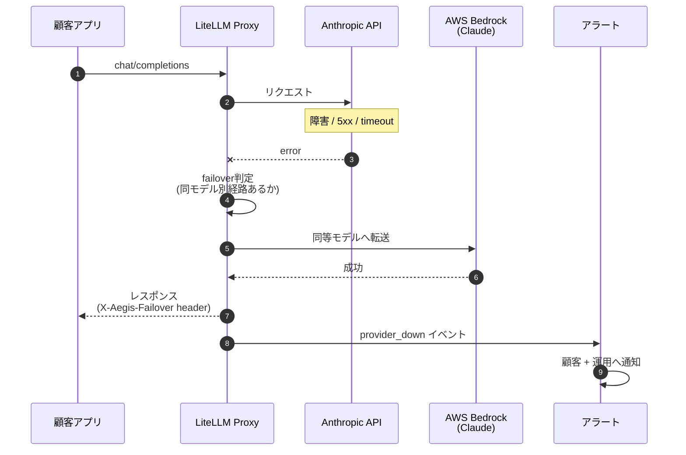
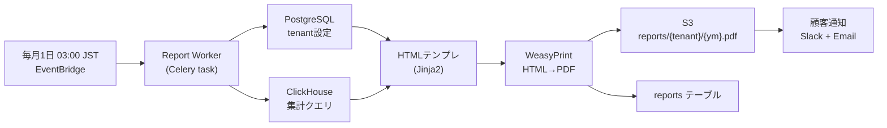
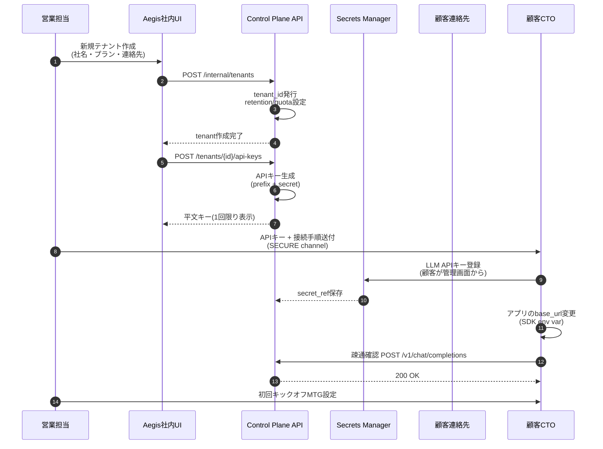
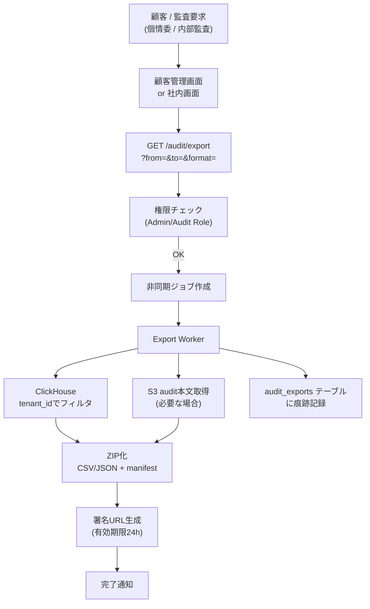
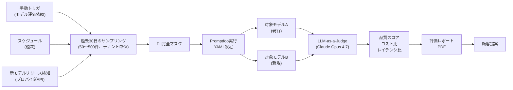
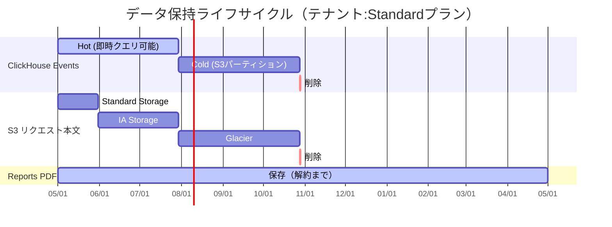
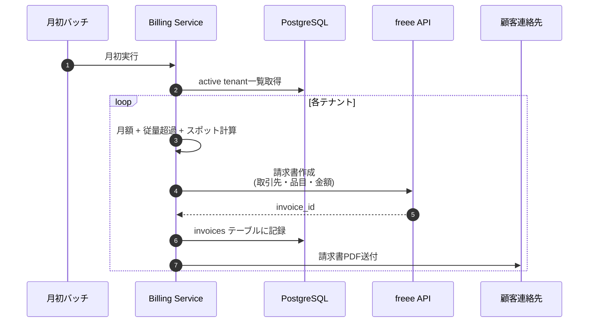

# データフロー図：Aegis

すべて Mermaid 記法。GitHubでレンダリング可能。

---

## DFL-01：システム全体（コンテキスト図）



---

## DFL-02：LLMリクエスト処理（同期パス）



---

## DFL-03：コスト・予算・アラート



### アラート閾値ルール

| ルールID | 条件 | severity | 通知先 |
|---|---|---|---|
| R-COST-D80 | 日次予算の80%消化 | warn | Slack |
| R-COST-D100 | 日次予算超過 | critical | Slack + Email |
| R-COST-D200 | 日次予算200%（hard cap） | critical | + 自動suspend |
| R-COST-M80 | 月次予算80% | warn | Slack |
| R-ERR-5XX | 5xxレート 5% × 5分 | warn | Slack |
| R-ERR-PROV | プロバイダ完全停止 | critical | Slack + auto-failover |
| R-PII | 高機密PII検知（マイナンバー等） | critical | Email |
| R-LAT-P99 | p99レイテンシ前日比+3σ | info | Slack |

---

## DFL-04：フェイルオーバー



ルーティング設定例（顧客テナント単位、YAML）：

```yaml
model_list:
  - model_name: claude-opus-4-7
    litellm_params:
      model: anthropic/claude-opus-4-7
      api_key: os.environ/CUSTOMER_ANTHROPIC_KEY
    failover:
      - model: bedrock/anthropic.claude-opus-4-7-v1:0
        api_key: os.environ/CUSTOMER_AWS_KEY
```

---

## DFL-05：月次レポート生成



レポート生成のステップ：

1. テナント全件取得（active のみ）
2. テナントごとに前月分のClickHouse集計クエリ（コスト、呼出、エラー、レイテンシ、モデル別、user_label別）
3. インシデント一覧（alerts テーブル）取得
4. 改善提案（プランによりLLMで自動生成 + オペレーターが朱入れ）
5. HTML → PDF → S3保存
6. 顧客通知（署名URL有効期限7日）

---

## DFL-06：プロビジョニング（顧客オンボーディング）



---

## DFL-07：監査ログエクスポート



エクスポート内容：
- メタ：tenant_id、期間、リクエスト件数、エクスポート実施者、目的
- 本体：イベント一覧CSV（コスト、モデル、ステータス、user_label、PII検知フラグ）
- 本文（要求時）：S3から取得した マスク済み req/res JSON
- manifest.json：SHA256ハッシュ、件数、エクスポート時刻

---

## DFL-08：Eval自動実行（v1機能）



---

## DFL-09：データ保持・削除ライフサイクル



プラン別保持期間：

| プラン | events | 本文 |
|---|---|---|
| Lite | 90日 | 30日 |
| Standard | 180日 | 90日 |
| Pro | 365日 | 180日 |
| Pro + Audit Addon | 365日 | 365日 |

---

## DFL-10：請求フロー（freee連携、v1）



---

## 補足：データの境界（What goes where）

| データ種別 | 保存先 | 暗号化 | 保持 |
|---|---|---|---|
| テナントメタデータ | PostgreSQL | TDE | 解約まで |
| APIキーハッシュ | PostgreSQL | TDE | 失効まで |
| 顧客LLMプロバイダAPIキー | Secrets Manager | KMS | 解約まで |
| LLMイベント（数値メタ） | ClickHouse | 保管時暗号化 | プラン別 |
| リクエスト/レスポンス本文 | S3 | KMS Envelope | プラン別 |
| アラート履歴 | PostgreSQL | TDE | 解約まで |
| 月次レポートPDF | S3 | KMS | 解約まで |
| 監査エクスポート履歴 | PostgreSQL | TDE | 7年 |
| 顧客アプリのソースコード | ❌保管しない | - | - |
| 顧客従業員の個人情報 | ❌保管しない（PIIマスク） | - | - |
